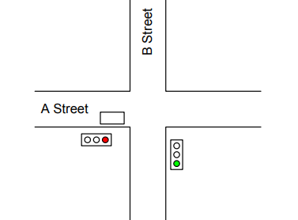
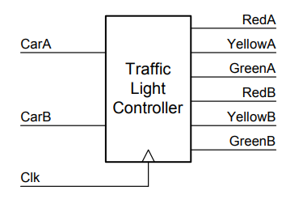
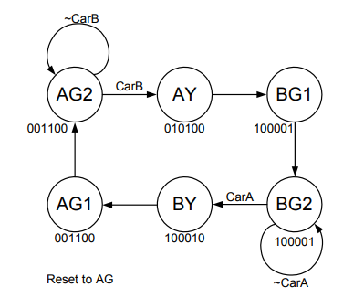
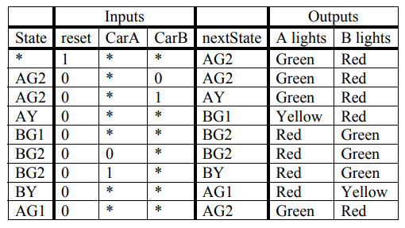
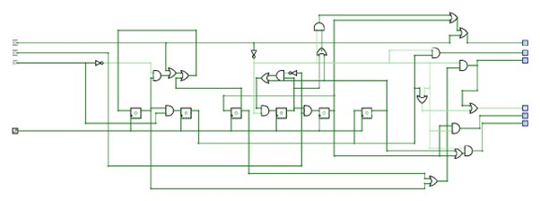
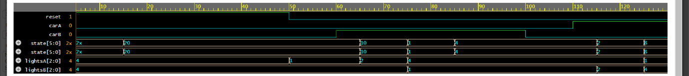

# TRAFFIC LIGHT CONTROLLER 🚦

## AIM:
To prepare a simple traffic light controller using verilog

## THEORY:



Consider the problem of controlling a traffic light at the intersection of two equally busy streets, A Street and B Street. Our traffic light controller takes two inputs – CarA (which is high when there is a car just before the intersection on A Street – in either direction), and CarB (which is high when there is a car just before the intersection on B street). The controller needs to generate six outputs – RedA, YellowA, GreenA, RedB, YellowB, and GreenB – which drive the respective traffic lights for A Street and B Street. In the figure above, CarA will be high, since there is a car (the rectangle) on A Street, and CarB will be low, since there is no car on B Street. Also in the Figure RedA is high since A Street has a red light, and GreenB is high since B Street has a green light. All other outputs are low. We can think of the traffic light controller as a black box that takes two inputs (and a clock) and generates six outputs as shown below. 



1.	When the light is green on A Street and a car is waiting on B Street, give A Street a yellow light for one clock cycle and then give A Street a red light and B Street a green light for at least two cycles.
2.	When the light is green on A Street and there is no car on B Street, leave the light green on A Street.
3.	When the is green on B Street (and we’ve finished the two cycles from step 1) and a car is waiting on A Street, give B Street a yellow light for one clock cycle and then give B Street a red light and A Street a green light for at least two cycles.
4.	When the light is green on B Street and there is no car on A Street, leave the light green on B Street.
5.	When you press the reset switch, after no more than six cycles, the light should be initially green on A Street and red on B Street and the controller should be ready for operation.


## WORKING:

We can translate these five rules into the following state diagram. For clarity, we omit the transitions that take all states to state AG2 (A Green 2nd cycle) when reset is true.



Each circle in the state diagram represents a state. The name of the state is in the circle and the state of the six output lines (in the order listed above) is shown below that state. The transitions between the states are labeled with the signals that make these transitions occur. Most of the edges have no label which indicates that the transition always occurs (unless reset is asserted).
When our finite-state machine (FSM) is in state AG2, A Street has a green light and B Street has a red light. The transition from AG2 back to itself indicates that as long as there is no car on B Street we keep the A Street light green. The transition to AY (for A Yellow) indicates that if there is a car on B Street, we make the A Street light yellow on the next cycle. AY always transitions to BG1 (for B Green 1st cycle) where the A Street light becomes red and the B Street light becomes green. BG1 always transitions to BG2 where the FSM waits for a car on A Street before sequencing through BY and AG1 back to AG2.
From this state diagram we can write the following state table:



## CIRCUIT DIAGRAM IMPLEMENTED:



### INPUTS FOR D FLIP FLOPS:
```
D1 = Q3 + (~CB)•(Q1) + reset
D2 = Q1•CB
D3 = Q5
D4 = (Q6 + (Q4•(~CA)) + reset
D5 = Q4•CB
D6 = Q2
```
### OVERALL OUPUTS:
```
RedA = Q5 + reset + (~reset) •(Q4 + Q6)
YellowA = Q2 • (~reset)
GreenA = (~reset) •(Q1 + Q3)

RedB = Q2 + reset + (~reset) •(Q1 + Q3)
YellowB = Q5•(~reset)
GreenB = (~reset) •(Q5 + Q6)
```

## DESIGN CODE:
```
module TLC(clk, reset, carA, carB, lightsA, lightsB) ;
input clk ; // clock
input reset ; // reset
input carA ; // a car is waiting on A Street
input carB ; // a car is waiting on B Street
output[2:0] lightsA ; // Red, Yellow, Green lights for A Street
output[2:0] lightsB ; // Red, Yellow, Green lights for B Street
reg ag2, ay, ag1, bg2, by, bg1 ; // state bits
wire nag2, nay, nag1, nbg2, nby, nbg1 ; // next state bits
wire[5:0] state ; // for observation only
assign state = {ag2, ay, ag1, bg2, by, bg1} ;
// state equations
assign
nag2 = ag1|(ag2 & ~carB)|reset ,               // D1 = Q3 + (~CB)•(Q1) + reset 
nay = ag2 & carB ,                                                                        // D2 = Q1•CB
nbg1 = ay ,                                                                                            // D3 = Q5
nbg2 = (bg1|(bg2 & ~carA))&~reset,         // D4 = (Q6 + (Q4•(~CA)) + reset
nby = bg2 & carA ,                                                                        // D5 = Q4•CA
nag1 = by ;                                                                                            // D6 = Q2
// flip flops
always @(posedge clk)
{ag2, ay, ag1, bg2, by, bg1} = {nag2, nay, nag1, nbg2, nby, nbg1} ;
// output equations
assign
lightsA[2] = by | lightsB[0] | reset , // red 
lightsA[1] = ay & ~reset , // yellow
lightsA[0] = (ag1 | ag2) & ~reset, // green
lightsB[2] = ay | lightsA[0] | reset, // red
lightsB[1] = by & ~reset, // yellow
lightsB[0] = (bg1 | bg2) & ~reset ; // green
endmodule
```

## TESTBENCH CODE:
```
`timescale 1ns/1ns
module TLC_tb;
// Parameters
parameter CLK_PERIOD = 10; // Clock period in ns
// Inputs
reg clk;
reg reset;
reg carA;
reg carB;
// Outputs
wire [2:0] lightsA;
wire [2:0] lightsB;
wire [5:0] state;
// Instantiate the TLC module
TLC uut (
 .clk(clk),
 .reset(reset),
 .carA(carA),
 .carB(carB),
 .lightsA(lightsA),
 .lightsB(lightsB)
);
// Connect the state output of TLC to state wire in testbench
assign state = uut.state;
// Clock generation
always #((CLK_PERIOD)/2) clk = ~clk;
// Initial values
initial begin
 clk = 0;
 reset = 1;
 carA = 0;
 carB = 0;
 #10; // Wait for a few cycles
 // Test cases
 reset = 1; carA = 0; carB = 0; #10; // 1
 reset = 1; carA = 0; carB = 0; #10; // 2
 reset = 1; carA = 0; carB = 0; #10; // 3
 reset = 1; carA = 0; carB = 0; #10; // 4
 reset = 0; carA = 0; carB = 0; #10; // 5
 reset = 0; carA = 0; carB = 1; #10; // 6
 reset = 0; carA = 0; carB = 1; #10; // 7
 reset = 0; carA = 0; carB = 1; #10; // 8
 reset = 0; carA = 0; carB = 1; #10; // 9
 reset = 0; carA = 0; carB = 0; #10; // 10
 reset = 0; carA = 1; carB = 0; #10; // 11
 reset = 0; carA = 1; carB = 0; #10; // 12
 $finish; // End simulation
end
// Display outputs
always @(posedge clk) begin
 $display("reset = %b carA = %b carB = %b : lightsA = %b lightsB = %b state =%b%b%b%b%b%b",
 reset, carA, carB, lightsA, lightsB, state[5], state[4], state[3], state[2], state[1], state[0]);
end
endmodule
```
### CODE EXPLANATION:
#### DESIGN CODE:

Functionality:
 The Verilog module TLC defines a traffic light controller with inputs for clock (clk), reset (reset), and car presence on streets A and B (carA, carB). It generates outputs (lightsA, lightsB) to control the traffic lights and uses registers (ag2, ay, ag1, bg2, by, bg1) and wires (nag2, nay, nag1, nbg2, nby, nbg1) to manage internal state transitions and next state calculations (state).

Operation:
 The module updates its internal state (ag2, ay, ag1, bg2, by, bg1) based on clock edges and input conditions, calculates next state bits (nag2, nay, nag1, nbg2, nby, nbg1) using state equations, and determines the output state of traffic lights (lightsA, lightsB) based on the current state and reset conditions using output equations.

#### TESTBENCH CODE:

Purpose: 
This Verilog testbench (TLC_tb) is designed to simulate the behavior of the TLC module by providing input stimuli (clk, reset, carA, carB) and observing the corresponding outputs (lightsA, lightsB) and internal state (state). It helps validate the functionality and correctness of the TLC module under various test cases.

Operation: 
The testbench initializes the inputs, generates a clock signal (clk), applies test cases with different input combinations, and displays the resulting outputs and state changes using $display. The testbench also connects the state wire to observe the internal state of the TLC module during simulation.


## OUPUT:
```
reset = 1 carA = 0 carB = 0 : lightsA = 100 lightsB = 100 state = 100000
reset = 0 carA = 0 carB = 0 : lightsA = 001 lightsB = 100 state = 100000
reset = 0 carA = 0 carB = 1 : lightsA = 100 lightsB = 001 state = 000001
reset = 0 carA = 1 carB = 0 : lightsA = 001 lightsB = 100 state = 001000
reset = 0 carA = 0 carB = 1 : lightsA = 100 lightsB = 001 state = 000001
reset = 0 carA = 1 carB = 0 : lightsA = 001 lightsB = 100 state = 001000
reset = 0 carA = 0 carB = 1 : lightsA = 100 lightsB = 001 state = 000001
reset = 0 carA = 1 carB = 1 : lightsA = 001 lightsB = 100 state = 001000
reset = 0 carA = 1 carB = 0 : lightsA = 100 lightsB = 010 state = 000010
reset = 0 carA = 0 carB = 1 : lightsA = 100 lightsB = 001 state = 000001
reset = 0 carA = 1 carB = 0 : lightsA = 001 lightsB = 100 state = 001000
reset = 0 carA = 1 carB = 1 : lightsA = 100 lightsB = 001 state = 000001
```




